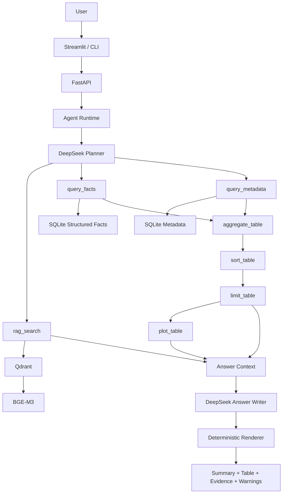
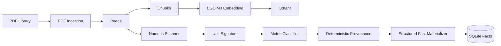

# LiteratureAgent

> 面向科研文献的本地 AI Agent：支持文献检索、结构化科研事实抽取、跨论文定量分析、证据追踪、可视化与增量知识库同步。


## 项目简介

LiteratureAgent 是一个面向科研场景构建的本地文献智能分析系统。

与普通“把 PDF 全部塞给大模型”的 RAG Demo 不同，本项目将 **LLM 规划、结构化事实库、确定性计算、证据渲染** 分离：

- **DeepSeek Planner** 负责把自然语言问题拆解成工具调用计划；
- **SQLite Structured Facts** 保存可比较的科研指标；
- **Python / SQLite** 负责排序、聚合、Top-K 等确定性计算；
- **Qdrant + BGE-M3** 负责语义检索；
- **DeepSeek Answer Writer** 只接收压缩后的最终结果上下文；
- **Deterministic Renderer** 输出表格、证据与数据质量提示。

对于：

> 统计所有论文输出功率的前十名

系统不会把数百篇论文逐篇交给 LLM，而是执行：

```text
User Question
    ↓
DeepSeek Planner
    ↓
query_facts
    ↓
aggregate_table
    ↓
sort_table
    ↓
limit_table
    ↓
Answer Writer
    ↓
Deterministic Renderer
```

在线查询阶段主要读取已经物化的结构化事实，避免昂贵的逐论文 LLM 抽取。

---

## 核心能力

### 1. 文献 RAG 问答

支持基于本地 PDF 知识库进行科研问题检索，例如：

```text
为什么加入 BaTiO3 后压电输出会增强？
```

查询链路：

```text
Question
→ DeepSeek Planner
→ rag_search
→ Qdrant / BGE-M3
→ Answer Writer
```

### 2. 跨论文结构化定量分析

支持科研指标的跨论文比较，例如：

```text
统计所有论文输出功率的前十名
```

```text
比较所有论文作者自己报告的功率密度，
按从高到低排序并绘制图表
```

系统会优先从 SQLite Structured Facts 中读取标准化数据，再由确定性工具完成：

- 分组
- max / min / mean / median / sum / count
- 排序
- Top-K
- 绘图

LLM 不负责数学计算。

### 3. 科研数值自动扫描

系统会离线扫描论文中的数值与单位，例如：

- V / mV / kV
- A / μA / mA
- W / mW / μW
- Pa / kPa / MPa
- pC/N
- W/m²
- W/m³
- Hz
- °C
- J/cm³

Numeric Scanner 只识别“论文中出现了什么数字”，不直接猜测科研语义。

### 4. Metric Ontology

Numeric Mention 会进一步经过：

```text
Raw Number
→ Unit Signature
→ Dimensionality Routing
→ Metric Classification
```

当前可区分的指标包括：

```text
power
output_power
power_density
volumetric_power_density
incident_power_density
output_voltage
current
pressure
electric_field
energy_density
piezoelectric_charge_coefficient
...
```

这避免仅凭单位把不同物理量混在一起。

### 5. Provenance-aware Scientific Facts

系统不仅保存数值，还判断该数值属于：

```text
author_result
cited_literature
uncertain
```

因此可以回答：

```text
只比较各论文作者自己报告的输出功率
```

而不会把 Review 中引用的其他论文结果误当作当前论文结果。

当 provenance 覆盖不足时，系统会在最终答案中明确显示数据质量提示，而不是把部分结果伪装成完整全库结论。

### 6. Evidence Traceability

结构化结果保留：

- 论文标题
- 页码
- 原始数值
- 标准化数值
- 单位
- 原文证据
- provenance
- confidence
- condition text

因此最终结果可以回溯到原始 PDF 证据。

### 7. 一键增量同步知识库

Streamlit 左侧提供：

```text
同步知识库
```

同步流程：

```text
PDF Library
    ↓
NEW / MODIFIED / DELETED / MOVED detection
    ↓
Pages
    ↓
Chunks
    ↓
BGE-M3 Embeddings
    ↓
Qdrant
    ↓
Numeric Mentions
    ↓
Unit Signatures
    ↓
Metric Classification
    ↓
Deterministic Provenance
    ↓
Materialized Structured Facts
```

增量策略：

- 未变化 PDF 不重新解析；
- 已存在 Chunks 不重新生成；
- 已存在向量不重新 Embedding；
- 已完成 Numeric Scan 的文档直接命中 cache；
- Metric / Provenance 只处理 pending rows；
- 删除论文时同步清理派生数据与向量。

Semantic Provenance 不会在普通同步中自动全库执行，避免产生大量不必要的 LLM 调用。

---

## 系统架构



---

## Knowledge Base Pipeline



---

## 技术栈

| Layer | Technology |
| --- | --- |
| LLM Planner / Writer | DeepSeek via SiliconFlow |
| Agent Runtime | Python |
| API | FastAPI |
| UI | Streamlit |
| Structured Data | SQLite |
| Vector Database | Qdrant |
| Embedding | BGE-M3 |
| PDF Parsing | PyMuPDF |
| Unit Parsing / Normalization | Pint |
| Plotting | Matplotlib |
| Validation | Pydantic |
| Testing | pytest |
| CI | GitHub Actions |

主要运行依赖包括 PyMuPDF、sentence-transformers、qdrant-client、OpenAI-compatible client、FastAPI、Streamlit、Pint 与 Matplotlib。

---

## 当前开发快照

截至 2026-09-10，本地开发知识库已验证：

| Item | Count |
| --- | ---: |
| PDFs | 331 |
| Indexed Documents | 329 |
| Pages | 7,222 |
| Chunks | 25,458 |
| Vectors | 25,458 |
| Materialized Structured Facts | 5,478 |

最近一次 deterministic test suite：

```text
165 passed
18 deselected
```

> 上述数字来自当前本地科研文献库，仅用于展示系统规模，会随着知识库同步继续变化。

---

## 项目结构

```text
LiteratureAgent/
├── app/
│   ├── agent/          # Planner / Executor / Answer pipeline
│   ├── api/            # FastAPI
│   ├── database/       # SQLite repositories and schema
│   ├── embedding/      # BGE-M3 indexing
│   ├── enrichment/     # numeric / metric / provenance / facts
│   ├── extraction/     # scientific fact schemas & normalization
│   ├── ingestion/      # PDF lifecycle and KB sync
│   ├── llm/            # SiliconFlow / DeepSeek client
│   ├── rag/            # retrieval pipeline
│   ├── tools/          # Agent tools
│   ├── ui/             # Streamlit UI
│   └── vectorstore/    # Qdrant
├── data/
│   ├── database/
│   ├── papers/
│   ├── plots/
│   └── qdrant/
├── docs/
│   └── images/
├── models/
├── test/
├── agent_cli.py
├── update_kb.py
├── update_numeric_mentions.py
├── update_unit_signatures.py
├── update_metric_classifications.py
├── update_provenance_classifications.py
├── update_semantic_provenance.py
├── update_materialized_facts.py
├── requirements.txt
├── requirements-dev.txt
└── README.md
```

---

## 安装

### 1. 创建虚拟环境

```bash
python3.11 -m venv .venv
source .venv/bin/activate
```

### 2. 安装依赖

```bash
python -m pip install --upgrade pip
pip install -r requirements.txt
```

开发环境：

```bash
pip install -r requirements-dev.txt
```

### 3. 配置环境变量

```bash
cp .env.example .env
```

在 `.env` 中配置自己的 API Key 和本地路径。

请勿将 `.env`、API Key、Token 或私人 PDF 数据提交到 GitHub。

---

## 启动

### Terminal 1：FastAPI

```bash
uvicorn app.api.server:app --reload
```

API：

```text
http://127.0.0.1:8000
```

Swagger：

```text
http://127.0.0.1:8000/docs
```

### Terminal 2：Streamlit

```bash
streamlit run app/ui/streamlit_app.py
```

浏览器：

```text
http://localhost:8501
```

### CLI

```bash
python agent_cli.py
```

示例：

```text
请输入问题：统计所有论文输出功率的前十名
```

---

## 知识库同步

在 Streamlit 左侧点击：

```text
同步知识库
```

系统会自动检测：

```text
NEW
MODIFIED
DELETED
MOVED
UNCHANGED
```

并执行增量知识库更新。

可以使用维护脚本检查不同 enrichment 层的状态，例如：

```bash
python update_materialized_facts.py --stats-only
```

---

## Agent Tooling

| Tool | Responsibility |
| --- | --- |
| `rag_search` | 文献语义检索 |
| `query_metadata` | 查询文献元数据 |
| `query_facts` | 查询结构化科研事实 |
| `aggregate_table` | 分组与统计聚合 |
| `sort_table` | 确定性排序 |
| `limit_table` | Top-K / 截断 |
| `plot_table` | 结果可视化 |

Executor 根据 Planner 生成的 plan 动态调用工具。

例如：

```json
{
  "steps": [
    {"tool": "query_facts"},
    {"tool": "aggregate_table"},
    {"tool": "sort_table"},
    {"tool": "limit_table"}
  ]
}
```

---

## 为什么不直接让 LLM 读取全部论文？

对于数百篇论文，如果每次统计都逐篇发送给 LLM：

```text
N papers
×
LLM extraction
×
每次 query
```

会产生明显的：

- 延迟
- Token 成本
- API 调用成本
- 结果不稳定
- 数学错误风险
- provenance 混淆

LiteratureAgent 采用：

```text
Offline Enrichment
        ↓
Structured Fact Cache
        ↓
Online Deterministic Query
```

因此结构化统计在线阶段可以直接使用 SQLite 完成，而 LLM 只负责：

1. 理解用户意图；
2. 生成工具计划；
3. 对最终结果进行自然语言总结。

---

## 数据可信度设计

科研文献中的数值并不天然等价于“作者结果”。

例如一篇 Review 中可能出现：

```text
Previous work reported 520 mW ...
```

如果不做 provenance，系统可能错误地把 `520 mW` 归到 Review 本身。

因此 LiteratureAgent 显式维护：

```text
Metric Identity
+
Normalized Value
+
Provenance
+
Evidence
+
Coverage
```

当结果覆盖不完整时，Renderer 会输出数据质量 warning，而不是伪造缺失排名。

---

## Testing

运行 deterministic tests：

```bash
SILICONFLOW_API_KEY=dummy-ci-key \
python -m pytest test -q \
  -m "not integration and not llm and not slow"
```

检查 whitespace / patch 问题：

```bash
git diff --check
```

项目包含针对以下模块的回归测试：

- Knowledge Base lifecycle
- Numeric Scanner
- Unit Signature
- Metric Ontology
- Metric Classification
- Provenance Classification
- Structured Fact Materializer
- Cache-only Fact Query
- Table Operations
- Top-K
- Answer Coverage Warning
- Agent Runtime
- API / UI contracts

---

## 已实现

- [x] Recursive PDF library ingestion
- [x] Content-hash based KB reconciliation
- [x] Incremental Chunk / Vector indexing
- [x] Qdrant semantic retrieval
- [x] BGE-M3 local embedding
- [x] FastAPI backend
- [x] Streamlit dashboard
- [x] CLI
- [x] DeepSeek Agent Planner
- [x] Dynamic Tool Executor
- [x] Structured Numeric Mention Scanner
- [x] Unit Signature cache
- [x] Metric Ontology
- [x] Deterministic Metric Classifier
- [x] Deterministic Provenance Classifier
- [x] Optional Semantic Provenance cache
- [x] Structured Fact Materializer
- [x] Cache-only online Fact Query
- [x] Generic aggregation / sorting / Top-K
- [x] Coverage-aware deterministic answer warnings
- [x] One-click structured knowledge synchronization
- [x] Deterministic CI test workflow

---

## Roadmap

- [ ] Targeted Semantic Provenance Backfill
- [ ] 按 metric 定向提升 provenance coverage
- [ ] 更完整的科研指标 ontology
- [ ] Local LLM backend
- [ ] Qdrant Docker deployment for larger libraries
- [ ] Better experiment-condition extraction
- [ ] Structured evaluation benchmark
- [ ] Multi-library / multi-project workspace

---

## Design Principles

**1. LLM 负责理解，不负责确定性数学**

排序、聚合和 Top-K 全部由 Python / SQLite 完成。

**2. Online Query 不进行昂贵抽取**

结构化查询优先读取已经物化的 facts。

**3. 科研数据必须保留 evidence**

任何结构化事实都应尽可能追溯到 PDF 页码和原文。

**4. Provenance 是科研数据的一部分**

“这个数字是谁报告的”与“这个数字是多少”同样重要。

**5. 缓存和版本化优先**

Numeric detector、Metric Ontology、Provenance classifier、Materializer 都具有版本语义，避免不同算法版本的数据静默混用。

**6. 不为单个问题硬编码 production logic**

指标、排序、聚合和 Top-K 都通过通用 ontology / tool contract 处理。

---

## License

This project is currently maintained as a research / engineering portfolio project.

If you plan to reuse or redistribute the code, add an explicit open-source license before public release.
