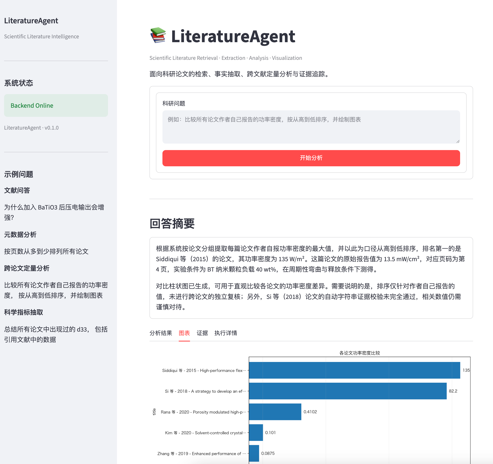
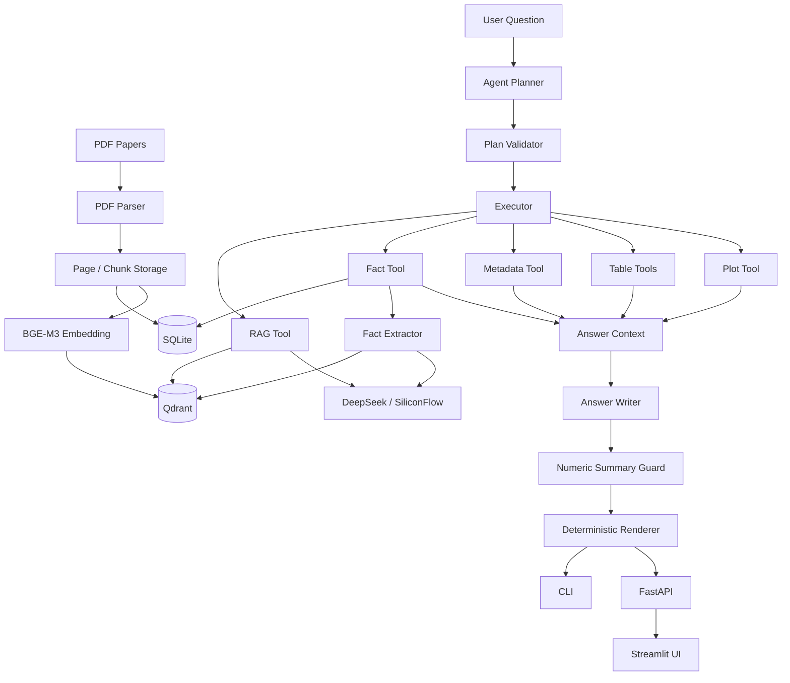

# LiteratureAgent

<p align="center">
  <strong>Scientific Literature Intelligence Agent</strong>
</p>

<p align="center">
  Grounded RAG · Structured Fact Extraction · Cross-Paper Quantitative Analysis · Scientific Data Validation
</p>

<p align="center">
  
  
  
  
  
  
</p>

<p align="center">
  
</p>

LiteratureAgent 是一个面向科研论文的智能文献分析 Agent，针对传统 RAG 难以可靠完成的 **跨论文定量分析、科学事实抽取、单位统一和证据追踪** 进行了专门设计。

它不仅可以回答：

> 为什么加入 BaTiO3 后压电输出会增强？

还可以处理：

> 比较所有论文作者自己报告的功率密度，统一单位后按从高到低排序，并生成图表。

系统会根据任务类型，在语义检索与结构化科学分析之间选择不同执行路径，并通过受约束的 Agent Plan 调用 RAG、Fact、Metadata、Table 和 Plot Tools。

---

## Why this is more than a basic RAG demo

传统 RAG 通常执行：

```text
Question
→ Global Top-K Retrieval
→ LLM
→ Answer
```

这适合文献问答，但不适合回答：

```text
“比较所有论文中的某个科学指标”
```

因为 Global Top-K 无法保证覆盖所有文档，也不能可靠完成物理单位转换、数值排序和来源区分。

LiteratureAgent 对定量任务采用另一条路径：

```text
User Question
    ↓
Structured Agent Plan
    ↓
Per-document Scientific Retrieval
    ↓
LLM Fact Extraction
    ↓
Provenance Classification
    ↓
Physical Unit Normalization
    ↓
SQLite Fact Store
    ↓
Deterministic Python Analysis
    ↓
Table / Plot / Evidence
```

核心原则是：

> **LLM handles semantics; deterministic tools handle numbers.**

LLM 负责：

```text
intent understanding
planning
semantic extraction
scientific language generation
```

Python / structured tools 负责：

```text
unit conversion
filtering
aggregation
sorting
plotting
numeric validation
```

因此 LLM 不直接负责跨论文数值计算。

---

## Key Engineering Highlights

- **Grounded literature QA** with source-level citation tracking
- **Per-document structured scientific fact extraction**
- **Dynamic scientific metric resolution**
- **Author result vs cited literature provenance separation**
- **Pint-based dimensionality validation**
- **Raw scientific value preservation**
- **Deterministic aggregation, sorting and visualization**
- **Validated structured Agent Plans**
- **Typed `TextResult` / `ToolResult` protocols**
- **Incremental SQLite ↔ Qdrant vector synchronization**
- **FastAPI application layer**
- **Streamlit scientific analysis workspace**
- **31-test pytest regression suite**

---


## Features

### Grounded Literature QA

针对机制解释、实验现象和论文内容问题，LiteratureAgent 使用：

```text
Question
→ Semantic Retrieval
→ Relevant Paper Chunks
→ Grounded LLM Answer
→ Source References
```

回答仅基于检索到的论文上下文，并返回实际被答案采用的文献来源。

---

### Structured Scientific Fact Extraction

对于功率密度、能量密度、击穿场强、输出电压、`d33` 等科研指标，系统不是简单从 Top-K chunks 中直接回答，而是执行：

```text
Metric
→ Per-document Retrieval
→ LLM Fact Extraction
→ Evidence Verification
→ Provenance Classification
→ Unit Normalization
→ SQLite Fact Cache
```

每条 Fact 可以记录：

- scalar / range / lower bound / upper bound
- 原始数值
- 原始单位
- 标准化数值
- 标准单位
- 页码
- chunk
- 实验条件
- evidence
- provenance
- confidence
- evidence verification state

---

### Cross-Paper Quantitative Analysis

对于类似：

> 比较所有论文作者自己报告的功率密度，按从高到低排序，并绘制图表

LiteratureAgent 会执行结构化工具链：

```text
query_facts
→ aggregate_table
→ sort_table
→ plot_table
```

LLM 不负责数值计算。

排序、聚合、单位转换和绘图均由确定性 Python 工具完成。

---

### Scientific Unit and Dimensionality Safety

科学文献中经常存在看起来相似、实际上物理量纲不同的数据。

例如：

```text
13.5 mW/cm²
```

属于面积功率密度，可以转换为：

```text
135 W/m²
```

而：

```text
1.48 μW/cm³
```

属于体积功率密度，不能转换为：

```text
W/m²
```

LiteratureAgent 对这一问题采用三层防护：

```text
Semantic Guard
    ↓
Fact Extractor 判断目标科学指标是否匹配

Physical Dimensionality Guard
    ↓
Pint 检查单位量纲是否可转换

Comparable-value Admission Guard
    ↓
转换失败的数据不得进入可比较 numerical field
```

因此，原始科学事实可以保留，但不兼容量纲的数据不会污染跨论文排名。

---

### Provenance-Aware Extraction

LiteratureAgent 区分：

```text
author_result
cited_literature
uncertain
```

例如用户可以分别查询：

```text
只比较论文作者自己报告的结果
```

或者：

```text
总结所有论文中出现过的 d33，包括引用文献中的数据
```

避免将论文 Background / Related Work 中引用的数字误认为作者自己的实验结果。

---

### Agent Planning and Tool Execution

自然语言问题首先由 Planner 转换成结构化 `AgentPlan`。

示例：

```text
User Question
    ↓
Planner
    ↓
AgentPlan
    ↓
Plan Validator
    ↓
Executor
    ↓
Tool Registry
```

当前工具包括：

```text
rag_search
query_facts
query_metadata
filter_table
aggregate_table
sort_table
plot_table
```

计划不是任意 Python 代码，而是受约束、可验证的 Tool Plan。

---

## Architecture



---

## Two Answer Protocols

LiteratureAgent 将最终 Agent 输出分为两种协议。

### `grounded_text`

适用于文献问答：

```text
RAG
→ TextResult
→ Answer + Sources
```

LLM 生成的 grounded answer 被保留，来源由确定性 renderer 展示。

### `structured`

适用于定量分析：

```text
ToolResult
→ AnswerContext
→ Minimal WriterContext
→ LLM Summary
→ Numeric Guard
→ Deterministic Renderer
```

LLM 只负责编写摘要。

表格、数值、单位、Evidence、Warnings 和 Plot Path 均来自结构化结果。

---

## Knowledge Base Lifecycle

`data/papers/` 是论文知识库的 source of truth。

运行：

```bash
python update_kb.py
```

系统会执行：

```text
PDF Scan
→ NEW / MODIFIED / DELETED / UNCHANGED
→ SQLite Sync
→ Chunk Sync
→ Qdrant Reconciliation
```

文档通过 content hash 判断是否发生变化。

### Incremental Vector Index

LiteratureAgent 不会每次重新计算全部 Embedding。

系统比较：

```text
SQLite Chunk IDs
vs
Qdrant Point IDs
```

然后只处理：

```text
missing points
stale points
```

当 SQLite 与 Qdrant 已同步时：

```text
added = 0
deleted = 0
```

并且不会加载 BGE-M3 或调用 `embed_texts()`。

当前测试知识库：

```text
8 papers
97 pages
378 chunks
378 Qdrant points
```

---

## Tech Stack

### LLM

- DeepSeek via SiliconFlow
- OpenAI-compatible API client

### Retrieval

- BGE-M3
- Sentence Transformers
- Qdrant

### Data

- SQLite
- PyMuPDF

### Scientific Processing

- Pint
- Pydantic
- Matplotlib

### Agent

- Structured Planner
- Plan Validator
- Tool Registry
- Sequential Executor
- Typed Result Protocols

### Application

- FastAPI
- Streamlit
- CLI

### Testing

- pytest

---

## Project Structure

```text
LiteratureAgent/
├── app/
│   ├── agent/
│   │   ├── planner.py
│   │   ├── plan_validator.py
│   │   ├── executor.py
│   │   ├── runtime.py
│   │   ├── answer_context.py
│   │   ├── answer_writer.py
│   │   ├── answer_renderer.py
│   │   └── summary_guard.py
│   │
│   ├── api/
│   │   ├── routes.py
│   │   ├── schemas.py
│   │   └── server.py
│   │
│   ├── database/
│   │   ├── sqlite_db.py
│   │   └── fact_repository.py
│   │
│   ├── embedding/
│   │   ├── embedding_model.py
│   │   └── indexer.py
│   │
│   ├── extraction/
│   │   ├── fact_extractor.py
│   │   ├── metric_registry.py
│   │   ├── metric_resolver.py
│   │   ├── schemas.py
│   │   └── unit_normalizer.py
│   │
│   ├── ingestion/
│   │   ├── pdf_parser.py
│   │   ├── chunker.py
│   │   ├── ingest.py
│   │   └── kb_sync.py
│   │
│   ├── llm/
│   │   └── siliconflow_client.py
│   │
│   ├── rag/
│   │   ├── qa.py
│   │   └── retriever.py
│   │
│   ├── tools/
│   │   ├── fact_tool.py
│   │   ├── metadata_tool.py
│   │   ├── plot_tool.py
│   │   ├── rag_tool.py
│   │   ├── table_tool.py
│   │   ├── registry.py
│   │   └── schemas.py
│   │
│   ├── ui/
│   │   └── streamlit_app.py
│   │
│   └── vectorstore/
│       └── vector_store.py
│
├── data/
│   ├── database/
│   ├── papers/
│   ├── plots/
│   └── qdrant/
│
├── models/
├── test/
├── agent_cli.py
├── update_kb.py
├── pytest.ini
├── requirements.txt
├── requirements-dev.txt
├── .env.example
└── README.md
```

---

## Quick Start

### 1. Create Environment

Python 3.11 is recommended.

```bash
python3.11 -m venv .venv
source .venv/bin/activate
```

Install development dependencies:

```bash
pip install -r requirements-dev.txt
```

For runtime-only installation:

```bash
pip install -r requirements.txt
```

---

### 2. Configure LLM API

Copy the environment template:

```bash
cp .env.example .env
```

Edit `.env`:

```dotenv
SILICONFLOW_API_KEY=your_api_key
```

Do not commit `.env`.

---

### 3. Prepare Embedding Model

LiteratureAgent expects the local BGE-M3 model under:

```text
models/bge-m3/
```

The embedding model is loaded locally through Sentence Transformers.

---

### 4. Add Papers

Place PDF papers under:

```text
data/papers/
```

---

### 5. Build / Synchronize Knowledge Base

```bash
python update_kb.py
```

The command synchronizes:

```text
PDFs
→ SQLite
→ Chunks
→ Qdrant
```

and performs incremental vector indexing.

---

## Run

### CLI

```bash
python agent_cli.py
```

Example:

```text
按页数从多到少排列所有论文
```

```text
为什么加入 BaTiO3 后压电输出会增强？
```

```text
比较所有论文作者自己报告的功率密度，
按从高到低排序，并绘制图表
```

---

### FastAPI

Start the backend:

```bash
uvicorn app.api.server:app --reload
```

Health check:

```text
GET /health
```

Agent endpoint:

```text
POST /api/v1/agent/run
```

Interactive API documentation:

```text
http://127.0.0.1:8000/docs
```

Example request:

```json
{
  "question": "按页数从多到少排列所有论文"
}
```

---

### Streamlit

Keep FastAPI running, then start Streamlit in another terminal:

```bash
streamlit run app/ui/streamlit_app.py
```

Open:

```text
http://localhost:8501
```

The UI communicates with the Agent through HTTP:

```text
Browser
→ Streamlit
→ FastAPI
→ Agent Runtime
```

Streamlit does not directly import Planner, Executor, RAG, or Tools.

---

## Example Scientific Analysis

For:

```text
比较所有论文作者自己报告的功率密度，
按从高到低排序
```

LiteratureAgent can normalize heterogeneous units to `W/m²`.

Example results from the current test corpus:

| Paper | Normalized Power Density |
|---|---:|
| Siddiqui et al. | 135 W/m² |
| Si et al. | 82.2 W/m² |
| Rana et al. | 0.4102 W/m² |
| Kim et al. | 0.101 W/m² |
| Zhang et al. | 0.0875 W/m² |

A volumetric value such as:

```text
1.48 μW/cm³
```

is not admitted into this area-power-density comparison.

---

## Testing

The project currently contains:

```text
31 pytest tests
```

covering:

- API contracts
- Planner
- Plan Validator
- Executor
- Agent Runtime
- Answer Context
- Answer Writer
- RAG
- document-scoped retrieval
- fact extraction
- fact repository
- fact tools
- unit normalization
- dimensionality safety
- scientific value rendering
- table operations
- aggregation
- plotting
- incremental vector indexing

### Deterministic Test Suite

For normal development:

```bash
python -m pytest test -q \
  -m "not integration and not llm and not slow"
```

Current deterministic suite:

```text
15 passed
```

### Planner / Real LLM Tests

```bash
python -m pytest test/test_planner.py -q
```

### Integration Tests

Example:

```bash
python -m pytest test/test_executor.py -q
```

### Full Test Suite

```bash
python -m pytest test -q
```

Some tests make real LLM calls, load BGE-M3, access the local knowledge base, or generate plots, so the complete suite is intentionally slower.

---

## Test Categories

The project uses pytest markers:

```text
integration
llm
slow
```

Examples:

```bash
python -m pytest test -q -m llm
```

```bash
python -m pytest test -q -m integration
```

```bash
python -m pytest test -q -m slow
```

---

## Engineering Principles

### LLMs should not perform deterministic numerical work

LLMs are used for:

```text
intent understanding
planning
semantic extraction
scientific language generation
```

Python tools are used for:

```text
unit conversion
sorting
aggregation
filtering
plotting
numeric validation
```

---

### Retrieval strategy depends on task type

Normal literature QA:

```text
global semantic retrieval
→ Top-K chunks
→ grounded answer
```

Cross-paper quantitative analysis:

```text
iterate documents
→ document-scoped retrieval
→ structured extraction
→ normalized fact store
→ deterministic analysis
```

This avoids using a single global Top-K retrieval as a substitute for exhaustive cross-paper analysis.

---

### Structured plans instead of arbitrary generated code

The Planner can only select predefined tools with validated arguments.

The LLM is not allowed to generate arbitrary Python for execution.

This improves:

- safety
- debuggability
- reproducibility
- testability

---

### Preserve raw scientific evidence

Unit normalization never destroys the original scientific value.

The system retains:

```text
raw_value
raw_unit
evidence
page_number
source_chunk
```

even when normalization fails.

---

## Current Limitations

LiteratureAgent is currently designed as a local research prototype.

Current limitations include:

- single-user local deployment
- synchronous Agent execution
- no persistent multi-turn conversation state
- local BGE-M3 model required
- local SQLite and Qdrant storage
- extraction quality still depends on source PDF text quality
- dynamic scientific metrics may require additional validation for domain-specific edge cases

The current Streamlit interface should therefore be interpreted as a scientific analysis workspace rather than a conversational multi-turn assistant.

---

## Roadmap

Potential future improvements:

```text
Dockerized deployment
Embedding / chunk version tracking
Conversation sessions
Async / streaming execution
Evaluation dataset
Retrieval metrics
Fact extraction benchmark
Human verification workflow
Additional scientific visualization
Multi-user deployment
```

---

## Security

API credentials are loaded from:

```text
.env
```

The repository contains only:

```text
.env.example
```

Local PDFs, vector databases, SQLite databases, generated plots, model files, and API secrets are excluded through `.gitignore`.

---

## License

This project is currently intended as a research and engineering portfolio project.
